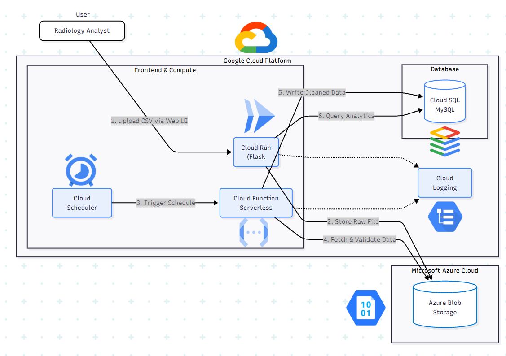

# Architecture & Implementation Plan: Radiology Turnaround Time Analytics

## 1. Service Mapping

| Layer | Service (Cloud) | Role in Solution | Related Assignment/Module |
|------|------------------|------------------|---------------------------|
| Frontend / Access | GCP Cloud Run (Flask web app) | Upload CSV files and display turnaround time analytics dashboard | Assignment 2 – Flask & Networking |
| Storage | Azure Blob Storage | Store raw uploaded CSV files for durability and reprocessing | Module 6 – Storage |
| Compute (Serverless) | GCP Cloud Functions | Validate and clean CSV files, compute turnaround time metrics, and write results to SQL | Assignment 3 – Serverless & Module 5 |
| Trigger / Scheduling | GCP Cloud Scheduler | Triggers the serverless processing function on a schedule | Assignment 3 – Serverless |
| Database / SQL | GCP Cloud SQL (MySQL) | Store cleaned data and aggregated summary tables for analytics | Assignment 4 & Module 7 – Databases |
| Observability | GCP Cloud Logging | Capture logs for uploads, processing runs, and errors | Module 1 – Cloud Fundamentals |

## 2. Architecture Diagram

## 3. Data Flow Narrative

1. A user uploads a radiology workflow CSV file through the Flask web application on Cloud Run.
2. The raw CSV file is stored in Azure Blob Storage to preserve original data for auditing and reprocessing.
3. GCP Cloud Scheduler triggers a serverless Cloud Function at regular intervals.
4. The Cloud Function identifies new/unprocessed files, validates required columns, standardizes timestamps, and computes turnaround time metrics.
5. Cleaned records and summary statistics are written to Cloud SQL (MySQL).
6. The Flask application queries summary tables from Cloud SQL and displays trends and bottlenecks in a dashboard.

## 4. Security, Identity, and Governance Basics

Database credentials and storage access keys are not hard-coded into the application. Instead, they are provided through environment variables or a secrets management service. Each component follows the principle of least privilege: the Cloud Run service only has access needed to upload files and read summary tables, while the Cloud Function can read raw files from storage and write results to Cloud SQL.

To reduce exposure of protected health information (PHI), the system focuses on operational workflow data such as timestamps, modality, and priority. Any identifiers that appear in uploaded files are removed or tokenized during processing. System logs record technical events like uploads, processing runs, and errors without storing PHI.

## 5. Cost and Operational Considerations

The major costs in this architecture come from the managed database (Cloud SQL) and compute used for data processing. Using serverless services such as Cloud Functions and Cloud Scheduler ensures that compute resources run only when needed, reducing unnecessary infrastructure costs compared to always-on VMs.

Azure Blob Storage provides a cost-effective way to store raw files while allowing reprocessing when needed without requiring re-uploads. Cost control can be achieved by adjusting processing frequency, applying data retention policies for raw files, and sizing the Cloud SQL instance appropriately for operational analytics workloads.